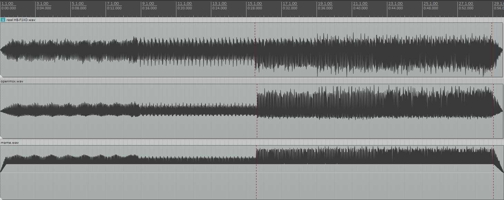

# [openMSX/openMSX#958](https://github.com/openMSX/openMSX/issues/958)

* [Real HB-F1XD.wav](real%20HB-F1XD.wav)
  
  <audio src="real%20HB-F1XD.wav" controls="controls"></audio> 

* [openMSX.wav](openmsx.wav)
  
  <audio src="openmsx.wav" controls="controls"></audio> 

* [MAME.wav](mame.wav)
  
  <audio src="mame.wav" controls="controls"></audio> 

 

